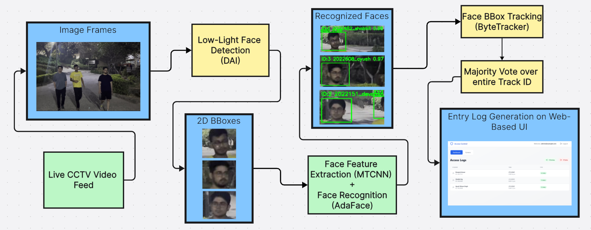

# IIITD-Gate-Entry-Automation

This repository presents a computer vision system developed to automate student gate entry at IIIT Delhi after 10 PM, designed to handle low-light conditions and real-world surveillance settings. The project integrates face detection, recognition, and temporal tracking from CCTV footage to log student entries seamlessly into an online database.
The project was developed for the [Computer Vision](https://techtree.iiitd.edu.in/viewDescription/filename?=CSE344) course at IIIT Delhi in Winter 2025.

<div style="display: inline-block; text-align: center; margin-right: 20px;">
    <b><u>System Architecture Pipeline:</u></b> <br>
    
</div>
<br>

**<h4>🛠️ Features:</h4>**
- **Low-Light Face Detection:** DAI detector for robust face bounding box localization under challenging illumination.
- **Face Recognition Backbone:** MTCNN for alignment + AdaFace (quality-adaptive margin) for identity prediction.
- **Temporal Consistency via Tracking:** ByteTrack to link detections across frames, with majority-vote merging to reduce ID fragmentation & for tracking multiple individuals in video streams.
- **Pipeline Optimizations:**
  -   Frame skipping + interpolation for faster inference.
  -   TorchVision’s optimized NMS for efficiency.
  -   Quantized detector (FP16) for reduced GPU memory usage.
- **Frontend Dashboard:** React + TypeScript web interface with:
  -   Dashboard Panel: Shows entry/exit logs (name, roll no., photo, timestamp).
  -   Live Surveillance Panel: Displays real-time CCTV feeds.
- **FastAPI Backend:** REST API and WebSocket support for live frame streaming and event logging.
- **Accuracy:** Achieved 87.5% recognition accuracy under low-light conditions with near real-time inference.

**<h4>📋 Installation & Usage:</h4>**
- Clone the repository and install the following Python libraries:
```bash
pip install fastapi uvicorn opencv-python torch torchvision numpy Pillow sqlite3 scipy python-multipart python-dotenv requests matplotlib scikit-learn
```
- Download the pretrained weights listed below and place them in `/weights` folder:
  - adaface_ir101_ms1mv3.ckpt
  - adaface_ir101_webface12m.ckpt
  - DarkFaceFS.pth
  - DarkFaceZSDA.pth
- Run the backend:
```bash
python app.py
```
- Start the frontend:
```bash
cd frontend
npm install
npm start
```
- Process videos:
  - Place your video files in the root directory & edit the `vid_name` variable in `main.py`
  - Run:
    ```bash
    python main.py
    ```
  - Output videos will be saved with `_complete.mp4`, `_lessdet.mp4`, or `_merge.mp4` suffixes.

**<h4>📂 Folder Structure:</h4>**
- `/adaface`: AdaFace identity recognition implementation.
- `/bytetrack`: ByteTrack multi-object tracker.
- `/frontend`: React + TypeScript web dashboard.
- `/weights`: Pretrained model weights (to be downloaded).
- `/data`, `/layers`, `/networks`: Supporting modules, scripts & configs (Dataset not released for privacy).
- `app.py`: FastAPI backend server.
- `dai.py`: DAI low-light face detection model.
- `main.py`: Complete pipeline, `main_lessdet.py`, `main_merge.py`: Batch video processing scripts - complete pipeline, reduced detection, and ID merge.

**<h4>📊 Results:</h4>**
- <b>Face Detection (DAI)</b> under low-light conditions: F1-score = <b>0.86</b>
- <b>Face Recognition (AdaFace):</b> Accuracy = <b>87.5%</b>
- <b>Pipeline Latency:</b> Optimized from ~2 min to <b>8.3s</b> for a 7s video (30 fps)

**<h4>🧑‍🤝‍🧑 Other Contributors:</h4>**
My IIIT Delhi batchmates Manan Aggarwal & Souparno Ghose also contributed in this project.

📌 Important: Please make sure to follow the guidelines and policies outlined by the institution regarding the use of shared coursework materials. Use this repository responsibly and avoid any violations of academic integrity. Codes are provided for reference purposes only. It's recommended to understand the codes and implement them independently.

